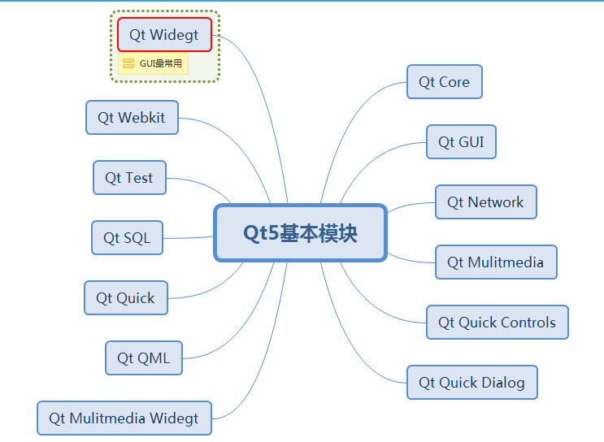
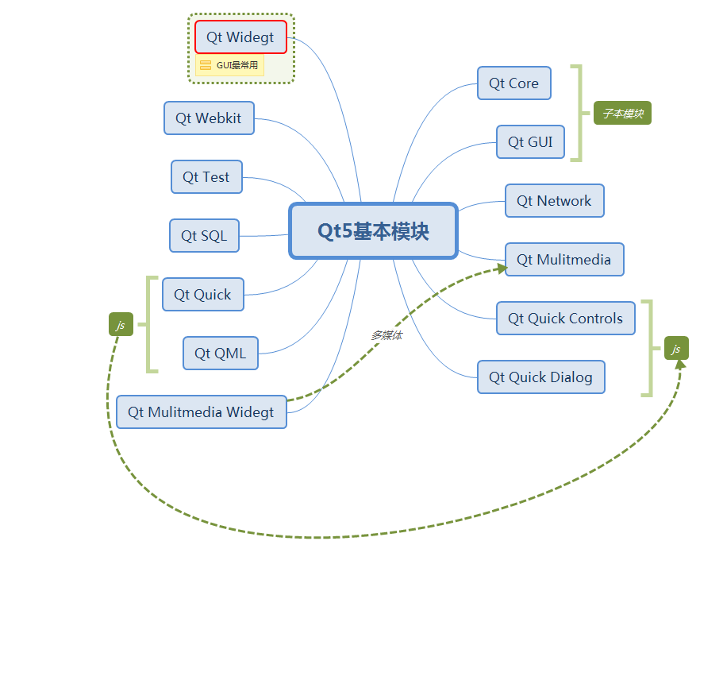

# QT文件介绍

```c++

#-------------------------------------------------
#
# Project created by QtCreator 2021-12-28T09:11:09
#
#-------------------------------------------------

QT       += core gui   // QT 包含的模块
QT       += serialport 
QT       += sql

greaterThan(QT_MAJOR_VERSION, 4): QT += widgets // 4版本以上加入widgets, 提高兼容性

TARGET = weather // exe文件名
TEMPLATE = app   // 模板 Application 应用程序

# The following define makes your compiler emit warnings if you use
# any feature of Qt which has been marked as deprecated (the exact warnings
# depend on your compiler). Please consult the documentation of the
# deprecated API in order to know how to port your code away from it.
DEFINES += QT_DEPRECATED_WARNINGS

# You can also make your code fail to compile if you use deprecated APIs.
# In order to do so, uncomment the following line.
# You can also select to disable deprecated APIs only up to a certain version of Qt.
#DEFINES += QT_DISABLE_DEPRECATED_BEFORE=0x060000    # disables all the APIs deprecated before Qt 6.0.0


SOURCES += \
        main.cpp \
        widget.cpp \
    serialport.cpp \
    weatherinstrument.cpp \
    mysqldatabase.cpp

HEADERS += \
        widget.h \
    serialport.h \
    weatherinstrument.h \
    mysqldatabase.h

FORMS += \
        widget.ui

```


## QT5模块




