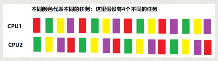
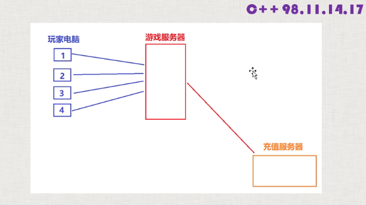
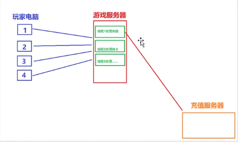

# 并发与多线程

## 并发/进程/线程的基本概念和综述

### 并发

+ 两个或者更多的任务（独立的活动）同时发生（进行）：一个程序同时执行多个独立的任务
+ 以往计算机，单核CPU（中央处理器）；某一时刻只能执行一个任务，有操作系统调度，每秒钟进行多次所谓的任务切换。
+ 并发的假象，不是真正的并发；这种切换（上下文切换）是要有时间开销的。比如操作系统要保持切换时的各种状态，执行进度等信息，都需要时间，一会切换回来的时候要复原这些信息。

> 硬件发展，出现了多处理器计算机，用于服务器和高性能计算领域
> 台式机：在一块芯片上有多核（多个）CPU，双核，4核，8核，10核。
> 能实现真正的并行执行多个任务（硬件开发）

+ 使用并发的原因：主要就是同时可以干多个事，提高性能
+ 

### 可执行程序

+ 磁盘上的一个文件
  + windows：一个扩展名为.exe
  + linux: ls -la, rwxrwxrwx

### 进程

+ windows： 双击一个可执行程序来运行
+ Linux： ./文件名

+ 进程：可执行程序运行起来，就叫创建一个进程
+ 进程，就是运行起来的可执行程序

### 线程

+ 每个线程（执行起来的可执行程序）， 都有一个主线程，这个主线程是唯一的，也就是一个进程中只能有一个主线程。
+ 当你执行要给可执行程序，产生一个进程后，这个主线程就随着这个进程默默的启动起来了
+ 运行程序，实际上是进程的主线程来执行（调用）这个main函数中的代码
+ 主线程与进程唇齿相依
+ 线程： 用来执行代码的
  + 线程这个东西，理解成一条代码的执行道路
+ 除了主线程外，我们可以通过自己写代码来创建其他线程
+ 我每创建一个新线程，可以在同一时刻，多干一个不同的事

### 多线程（并发）

+ 线程不是越多越好，每个线程，都需要一个独立的堆栈空间（1M），线程之间的切换要保存很多中间状态;
+ 切换会耗费本该属于程序运行的时间
+ 
+ 

### 总结线程

+ 线程是用来执行代码的
+ 把线程理解程一条代码的执行通路，一个新线程代表一条新的通路
+ 一个进程自动包含一个主线程，主线程随着进程默默的启动并运行，我们可以通过编码来创建多个其他线程；但是创建的数量最大不建议超过200-300个
+ 因为主线程是自动启动的，所以一个进程中最少有一个线程。进程和主线程属于父子关系
+ 多线程程序可以同时干多个事，所以运行效率高

#### 学习心得

+ 开发多线程程序：实力的体现，商用的必须需求
+ 线程开发有一定难度，线程代码实现复杂，理解上更难一些，需要一定的学习时间。
+ c++线程会涉及很多概念，对于c++道路上的成长特别关键，不要急于求成
+ 高薪，网络方向，多线程是绝对绕不开的

## 并发的实现方法

+ 两个或者更多的任务（独立的活动）同时发生（进行）
  + 我们通过多个进程实现并发。
  + 在单独的进程中，创建多个线程实现并发，自己写代码来创建除了主线程之外的其他线程

### 多进程并发

+ word，启动后就是进程
+ 账号服务器，游戏逻辑服务器，服务器进程之间的通信
+ 进程之间通信（同一台电脑上，管道，文件，消息队列，共享内存；不同电脑上：socket通信技术）

### 多线程并发

+ 单个进程中，创建了多个线程
+ 线程：感觉像轻量级进程。每个线程都有自己独立的运行路径，但是一个进程中的所有线程共享地址空间（共享内存）；全局变量，指针，引用，都可以在线程之间传递，所以，使用多线程开销远远小于多线程。
+ 共享内存带来新问题，数据一致性问题，线程A，线程B；

> 多进程并发和多线程并发虽然可以混合使用，但最好优先考虑多线程技术手段而不是多进程

### 总结

+ 和进程比，线程有如下优点：
  + 线程启动速度更快，更轻量
  + 系统资源开销更小，执行速度更快，比如共享内存这种通信方式比任何其他的通信方式都快。
+ 但有如下缺点：
  + 使用有一定难度，要小心处理数据一致性问题

## C++11新标准线程库

+ 以往：
  + windows： CreateThread(); _beginthreadexe
  + linux:  pthead_create()
+ 以往多线程代码不能跨平台
+ 临界区，互斥量
+ POSIX thread(pthread) //跨平台，需要预先配置

> 从c++11新标准，c++语言本省增加对多线程的支持,意味着可移植性（跨平台）,这大大减少了开发人员工作量

  